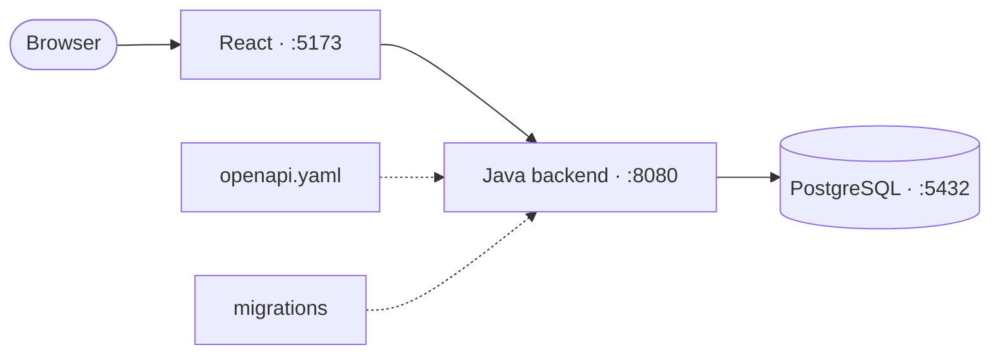

# Employee Portal

[](https://github.com/dierodfer/demo-jam/actions/workflows/ci-backend.yml)
[](https://github.com/dierodfer/demo-jam/actions/workflows/ci-frontend.yml)
[](https://sonarcloud.io/project/overview?id=dierodfer_demo-jam)
[](https://sonarcloud.io/project/issues?id=dierodfer_demo-jam)
[](https://sonarcloud.io/project/issues?id=dierodfer_demo-jam)


Employee portal with a **simulated login**, an editable profile and
certification management. Java backend, React frontend and PostgreSQL, all
running locally.

## Structure

```
backend-java/                   Backend (8080)
frontend-react/                 Frontend (5173)
shared/openapi.yaml             API contract
shared/migrations/              SQL schema migrations
scripts/contract-test.mjs       Contract tests
docker-compose*.yml             PostgreSQL and full stack
Makefile                        Entry point for every command
AGENTS.md / CLAUDE.md           Guide for AI agents
```



## Getting started

Requirements: Java 25 with Maven, Node 22 and Docker. Everything runs through
`make` (`make help` lists the commands).

```bash
make db-up            # PostgreSQL
make dev              # backend + frontend with hot reload
make up-java-react    # full stack in Docker (down-java-react to stop)
make verify           # contract tests (backend must be running)
```

The frontend reads `VITE_API_BASE` (default `http://localhost:8080`); in Docker
it is set as a build arg in the static build.

## API

The full contract is in [`shared/openapi.yaml`](shared/openapi.yaml).

| Method | Path | Description |
|--------|------|-------------|
| POST | `/api/login` | Opens a session (`JSESSIONID` cookie) |
| POST | `/api/logout` | Closes the session |
| GET / PUT | `/api/me` | Reads / updates the profile |
| GET / POST | `/api/certificaciones` | Lists / creates certifications |
| PUT / DELETE | `/api/certificaciones/{id}` | Updates / deletes a certification |

- Login uses a session cookie. Incorrect credentials and requests without a
  session return `401`.
- The frontend sends requests with `credentials: 'include'`.

```bash
curl -c cookies.txt -X POST http://localhost:8080/api/login \
  -H 'Content-Type: application/json' \
  -d '{"username":"admin","password":"anything"}'
curl -b cookies.txt http://localhost:8080/api/me
```

## Database

The schema is defined only by the migrations in
[`shared/migrations/`](shared/migrations), which the backend applies on startup
(`schema_migration` table). To change it, add a new migration; never edit one
that was already applied. In Docker, data persists in the `portal-db-data`
volume.

## Configuration

The backend reads `SERVER_PORT`, `DB_HOST`, `DB_PORT`, `DB_NAME`, `DB_USER`,
`DB_PASSWORD`, `MIGRATIONS_PATH`, `CORS_ALLOWED_ORIGIN` and `SEED_USERNAME`.

## Frontend

- **Login** and **Employee data**: editable profile.
- **Vacations**: yearly calendar with static demo data.
- **Skills / Certifications**: CRUD with search, sorting and pagination.
- **Other sections**: "Section not available" notice.

## Continuous integration

Two independent workflows, each triggered only when its own files change:

- [`ci-backend.yml`](.github/workflows/ci-backend.yml) (`backend-java/**`):
  Java tests and contract tests against PostgreSQL.
- [`ci-frontend.yml`](.github/workflows/ci-frontend.yml) (`frontend-react/**`):
  React install and build.

SonarCloud analyzes every push to `main` and every pull request.

## AI agents

Implementation and verification rules are in [`AGENTS.md`](AGENTS.md), which
also applies to Claude Code through [`CLAUDE.md`](CLAUDE.md). The workspace MCP
configuration (GitHub and Playwright) is in
[`.vscode/mcp.json`](.vscode/mcp.json); VS Code asks for a PAT scoped to this
repository and does not store it in the file.

## Out of scope

File uploads, Playwright e2e tests and Kubernetes.
