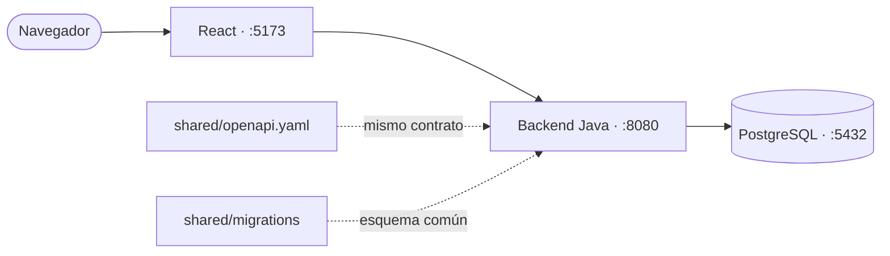

# Portal de Empleado (100% local)

Portal de empleado sencillo con **login simulado** y **perfil editable**,
construido para funcionar por completo en local. La aplicación usa un backend
Spring Boot, un frontend React y una base de datos PostgreSQL.

> **Estado actual**
>
> | Componente | Estado |
> |---|---|
> | `shared/openapi.yaml` (contrato) | ✅ Listo |
> | `backend-java` (Spring Boot 4.1.0 / Java 25) | ✅ Listo |
> | `frontend-react` (React 19.2 + Vite 8) | ✅ Listo |
> | `postgres` (PostgreSQL 16) | ✅ Listo |
> | Docker Compose | ✅ Listo |
> | `Makefile` | ✅ Listo |

## Estructura

```
.
├── backend-java/                   Spring Boot 4.1.0 (Java 25) + Dockerfile   → 8080
├── frontend-react/                 React 19.2 + Vite 8 (Docker: nginx)       → 5173
├── shared/openapi.yaml             Contrato de la API
├── shared/migrations/              Migraciones SQL del esquema
├── scripts/contract-test.mjs       Tests de contrato (make verify)
├── docker-compose.yml              Servicio PostgreSQL (5432)
├── docker-compose.java-react.yml   Stack backend-java + frontend-react
├── Makefile                        Atajos de instalación, dev, verify y docker
└── AGENTS.md / CLAUDE.md           Guía para agentes de IA (receta de features)
```

## Arquitectura

React publica `:5173`, Java `:8080` y PostgreSQL `:5432`. En Docker, el
frontend se sirve como build estático con nginx. El navegador llama a la API
directamente al puerto publicado del backend.



## Contrato de API

[`shared/openapi.yaml`](shared/openapi.yaml) define las rutas y formas JSON
que implementa el backend Java:

| Método | Ruta          | Descripción                              |
|--------|---------------|------------------------------------------|
| POST   | `/api/login`  | Login simulado. Abre sesión (cookie).    |
| GET    | `/api/me`     | Perfil del empleado (401 si no hay sesión). |
| PUT    | `/api/me`     | Actualiza el perfil.                     |
| POST   | `/api/logout` | Cierra la sesión.                        |
| GET    | `/api/certificaciones`      | Lista los conocimientos / certificaciones. |
| POST   | `/api/certificaciones`      | Crea una certificación.        |
| PUT    | `/api/certificaciones/{id}` | Actualiza una certificación.   |
| DELETE | `/api/certificaciones/{id}` | Elimina una certificación.     |

### Login simulado

- El único empleado sembrado (`id=1`) tiene el username **`admin`**.
- Se entra si el `username` coincide; **cualquier contraseña es válida**.
- La sesión se mantiene con la cookie `JSESSIONID`.
- El frontend debe hacer las peticiones con `credentials: 'include'`.

### Perfil del empleado (7 campos)

`nombre`, `email`, `telefono`, `puesto`, `departamento`, `direccion`, `foto`.

## Base de datos

Un servicio **PostgreSQL 16** en su propio contenedor (definido en
[`docker-compose.yml`](docker-compose.yml)). El backend Java se conecta a la
BBDD `portal` (usuario/clave `portal` por defecto, configurables con `DB_*`).
Los datos persisten en el volumen Docker `portal-db-data`, no en el sistema de
ficheros del repo.

El esquema lo definen las migraciones de
[`shared/migrations/`](shared/migrations): ficheros `NNN_descripcion.sql` en
sintaxis PostgreSQL que el backend Java aplica al arrancar. La tabla
`schema_migration` registra las migraciones ejecutadas. Hibernate está en
`ddl-auto=none`; el esquema se crea exclusivamente mediante migraciones. Para
cambiarlo, añade una migración nueva y nunca edites una ya aplicada. Los datos
demo (empleado y certificaciones) se siembran desde el backend Java.

## Puesta en marcha

Requisitos: **Java 25 + Maven**, **Node 22+** y **Docker** (al menos para
PostgreSQL). El `Makefile` lista los atajos disponibles con `make help`.

### En local

```bash
make db-up        # levanta PostgreSQL (5432)

make run-java     # backend Java en http://localhost:8080
make run-react    # frontend React en http://localhost:5173
# o ambos a la vez (incluye db-up):
make dev
```

### Con Docker

El stack incluye PostgreSQL, backend Java y frontend React:

```bash
make up-java-react     # PostgreSQL + backend Java + frontend React
make down-java-react   # parar los servicios
```

En Docker React se sirve como **build estático con nginx** en el puerto 5173;
en local `make run-react` usa el servidor de desarrollo Vite con hot-reload.
`VITE_API_BASE` se pasa como *build-arg* y queda horneada en el build.

### Probar la API

```bash
# Login (guarda la cookie de sesión)
curl -c cookies.txt -X POST http://localhost:8080/api/login \
  -H 'Content-Type: application/json' \
  -d '{"username":"admin","password":"lo-que-sea"}'

# Perfil
curl -b cookies.txt http://localhost:8080/api/me

# Actualizar perfil
curl -b cookies.txt -X PUT http://localhost:8080/api/me \
  -H 'Content-Type: application/json' \
  -d '{"puesto":"Tech Lead","telefono":"+34 611 000 999"}'

# Logout
curl -b cookies.txt -X POST http://localhost:8080/api/logout
```

### Tests de contrato

Con el backend arrancado, `scripts/contract-test.mjs` comprueba login, perfil,
CRUD de certificaciones y códigos de error; al terminar, restaura los datos
que modifica:

```bash
make verify        # contra el backend Java (8080)
```

## Backend

### `backend-java/` — Spring Boot 4.1.0 (Java 25)

Dependencias: `web`, `data-jpa`, driver `postgresql` (sin Spring Security).
CORS abierto a `http://localhost:5173`. Sesión vía `HttpSession`. Configurable
por variables de entorno (`SERVER_PORT`, `DB_HOST`, `DB_PORT`, `DB_NAME`,
`DB_USER`, `DB_PASSWORD`, `MIGRATIONS_PATH`, `CORS_ALLOWED_ORIGIN`,
`SEED_USERNAME`).

## Frontend

El frontend React replica el diseño del portal original de Nunegal. Incluye:

- **Login** — logo, «Acceso al Portal del Empleado», usuario/contraseña.
- **Datos del empleado** (pantalla inicial) — perfil con los 7 campos, editable.
- **Vacaciones** — calendario anual con festivos, días disfrutados/marcados,
  resumen por barras y leyenda (datos estáticos de demo).
- **Conocimientos / Certificaciones** — CRUD completo contra la BBDD: tabla con
  búsqueda, orden por columnas, paginación y tamaño de página, más alta/edición
  (modal) y borrado con confirmación. Sin adjuntar archivos.
- **Resto de secciones** — mensaje animado de «Sección no disponible» para la demo.

Más detalles en [`frontend-react/README.md`](frontend-react/README.md).

## Instrucciones para agentes

Las reglas de implementación y verificación para agentes están en
[`AGENTS.md`](AGENTS.md). La guía también se aplica a Claude Code mediante
[`CLAUDE.md`](CLAUDE.md).

## Fuera de alcance

- **GitHub**: se gestiona aparte.
- **Playwright / tests e2e**: descartados.
- **Kubernetes**: no aplica; son contenedores de Docker Compose.
