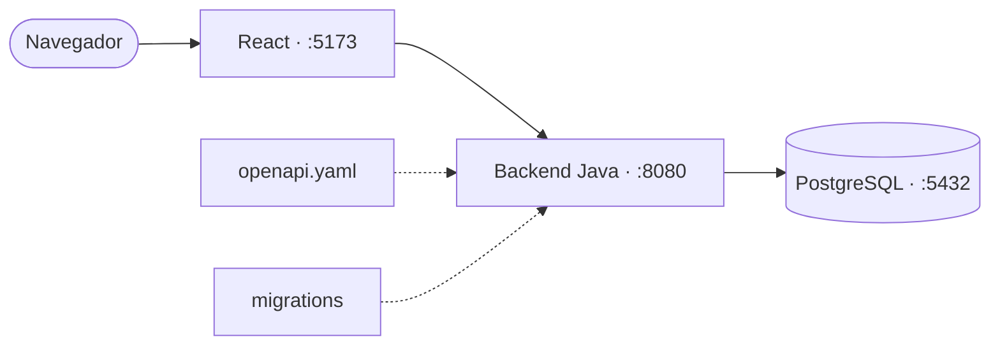

# Portal de Empleado

[](https://github.com/dierodfer/demo-jam/actions/workflows/ci-backend.yml)
[](https://github.com/dierodfer/demo-jam/actions/workflows/ci-frontend.yml)
[](https://sonarcloud.io/project/overview?id=dierodfer_demo-jam)
[](https://sonarcloud.io/project/issues?id=dierodfer_demo-jam)
[](https://sonarcloud.io/project/issues?id=dierodfer_demo-jam)

Portal de empleado con **login simulado**, perfil editable y gestión de
certificaciones. Backend Java, frontend React y PostgreSQL, todo en local.

## Estructura

```
backend-java/                   Backend (8080)
frontend-react/                 Frontend (5173)
shared/openapi.yaml             Contrato de la API
shared/migrations/              Migraciones SQL del esquema
scripts/contract-test.mjs       Tests de contrato
docker-compose*.yml             PostgreSQL y stack completo
Makefile                        Punto de entrada de todos los comandos
AGENTS.md / CLAUDE.md           Guía para agentes de IA
```



## Puesta en marcha

Requisitos: Java 25 con Maven, Node 22 y Docker. Todo se lanza con `make`
(`make help` lista los comandos).

```bash
make db-up            # PostgreSQL
make dev              # backend + frontend con hot-reload
make up-java-react    # stack completo en Docker (down-java-react para parar)
make verify           # tests de contrato (con el backend arrancado)
```

El frontend usa `VITE_API_BASE` (por defecto `http://localhost:8080`); en Docker
se fija como *build-arg* en el build estático.

## API

El contrato completo está en [`shared/openapi.yaml`](shared/openapi.yaml).

| Método | Ruta | Descripción |
|--------|------|-------------|
| POST | `/api/login` | Abre sesión (cookie `JSESSIONID`) |
| POST | `/api/logout` | Cierra la sesión |
| GET / PUT | `/api/me` | Consulta / actualiza el perfil |
| GET / POST | `/api/certificaciones` | Lista / crea certificaciones |
| PUT / DELETE | `/api/certificaciones/{id}` | Actualiza / elimina una certificación |

- Login simulado: el usuario es `admin` (`SEED_USERNAME`) y cualquier contraseña
  es válida. Sin sesión, la API responde `401`.
- El frontend hace las peticiones con `credentials: 'include'`.

```bash
curl -c cookies.txt -X POST http://localhost:8080/api/login \
  -H 'Content-Type: application/json' \
  -d '{"username":"admin","password":"lo-que-sea"}'
curl -b cookies.txt http://localhost:8080/api/me
```

## Base de datos

El esquema se define solo mediante las migraciones de
[`shared/migrations/`](shared/migrations), que el backend aplica al arrancar
(tabla `schema_migration`). Para cambiarlo, añade una migración nueva; nunca
edites una ya aplicada. Los datos demo los siembra el backend. En Docker los
datos persisten en el volumen `portal-db-data`.

## Configuración

El backend lee `SERVER_PORT`, `DB_HOST`, `DB_PORT`, `DB_NAME`, `DB_USER`,
`DB_PASSWORD`, `MIGRATIONS_PATH`, `CORS_ALLOWED_ORIGIN` y `SEED_USERNAME`.

## Frontend

- **Login** y **Datos del empleado**: perfil editable.
- **Vacaciones**: calendario anual con datos estáticos de demo.
- **Conocimientos / Certificaciones**: CRUD con búsqueda, orden y paginación.
- **Resto de secciones**: aviso de «Sección no disponible».

## Integración continua

Dos workflows independientes, cada uno solo se activa si cambian sus archivos:

- [`ci-backend.yml`](.github/workflows/ci-backend.yml) (`backend-java/**`):
  tests Java y tests de contrato contra PostgreSQL.
- [`ci-frontend.yml`](.github/workflows/ci-frontend.yml) (`frontend-react/**`):
  instalación y build de React.

SonarCloud analiza cada push a `main` y cada pull request.

## Agentes de IA

Las reglas de implementación y verificación están en [`AGENTS.md`](AGENTS.md),
que también aplica a Claude Code mediante [`CLAUDE.md`](CLAUDE.md). La
configuración MCP del workspace (GitHub y Playwright) está en
[`.vscode/mcp.json`](.vscode/mcp.json); VS Code pide un PAT limitado a este
repositorio y no lo guarda en el archivo.

## Fuera de alcance

Subida de archivos, tests e2e de Playwright y Kubernetes.
